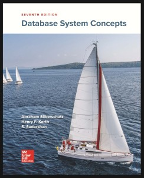

## Descrição

Esse repositório contém minha versão de soluções para o livro **[Sistema de Banco de Dados, 7a Edição](https://www.db-book.com/) (A. Silberschatz, H. Korth, S. Sudarshan)** (SBD).

## Apresentação

Espero que esse material chegue até estudantes e tutores de graduação e pós graduação que estejam cursando ou lecionande disciplinas relacionadas a Sistemas de Bancos de Dados.

Meu objetivo é que esse material sirva de complemento em português ao SBD. Naturalmente, muitos termos estão em inglês, sobretudo graças ao fato que os nomes de tabelas e colunas do material de laboratório estão em inglês - quem sabe um trabalho de tradução posterior para o autor ou para futuros apoiadores `;)`.

Muitas respostas são diferentes da versão das soluções disponibilizadas em inglês. Em algumas vezes, trata-se de preferência. Em outras, acredito que há erros na versão original. Deixarei ao leitor decidir. Em todo caso, estejam alertados!

Em caso de dúvidas, correções, ou sugestões, por favor abra uma issue ou um PR nesse repositório.

Bons estudos!

## Progresso

### Parte 0

#### Chap 1 - 15/15 - OK

### Parte 1

#### Chap 2 - 18/18 - OK

#### Chap 3 - 6/10

|3.1|3.2|3.3|3.4|3.5|3.6|3.7|3.8|3.9|3.10|
|-|-|-|-|-|-|-|-|-|-|
|OK|OK|OK|OK|OK|OK|-|-|-|-|

#### Chap 4 - 0/13

|4.1|4.2|4.3|4.4|4.5|4.6|4.7|4.8|4.9|4.10|4.11|4.12|4.13|
|-|-|-|-|-|-|-|-|-|-|-|-|-|
|-|-|-|-|-|-|-|-|-|-|-|-|-|

#### Chap 5 - 0/11

### Parte 2

#### Chap 6 - 0/13

|6.1|6.2|6.3|6.4|6.5|6.6|6.7|6.8|6.9|6.10|6.11|6.12|6.13|6.14|6.15|6.16|6.17|6.18|6.19|6.20|6.21|6.22|6.23|6.24|6.25|6.26|6.27|6.28|
|-|-|-|-|-|-|-|-|-|-|-|-|-|-|-|-|-|-|-|-|-|-|-|-|-|-|-|-|
|W|W|W|W|W|W|W|W|W|W|W|W|W|W|W|W|W|W|W|W|W|W|W|W|W|W|W|W|

#### Chap 7 - 0/20

|7.1|7.2|7.3|7.4|7.5|7.6|7.7|7.8|7.9|7.10|7.11|7.12|7.13|7.14|7.15|7.16|7.17|7.18|7.19|7.20|7.21|7.22|7.23|7.24|7.25|7.26|7.27|7.28|7.29|7.30|7.31|7.32|7.33|7.34|7.35|7.36|7.37|7.38|7.39|7.40|7.41|7.42|7.43|7.44|
|-|-|-|-|-|-|-|-|-|-|-|-|-|-|-|-|-|-|-|-|-|-|-|-|-|-|-|-|-|-|-|-|-|-|-|-|-|-|-|-|-|-|-|-|
|-|-|-|-|-|-|-|-|-|-|-|-|-|-|-|-|-|-|-|-|-|-|-|-|-|-|-|-|-|-|-|-|-|-|-|-|-|-|-|-|-|-|-|-|

### Parte 3

#### Chap 8 - 0/9

|8.1|8.2|8.3|8.4|8.5|8.6|8.7|8.8|8.9|8.10|8.11|8.12|8.13|8.14|8.15|
|-|-|-|-|-|-|-|-|-|-|-|-|-|-|-|
|-|-|-|-|-|-|-|-|-|-|-|-|-|-|-|

#### Chap 9 - 0/12

|9.1|9.2|9.3|9.4|9.5|9.6|9.7|9.8|9.9|9.10|9.11|9.12|9.13|9.14|9.15|9.16|9.17|9.18|9.19|9.20|9.21|9.22|9.23|9.24|9.25|9.26|
|-|-|-|-|-|-|-|-|-|-|-|-|-|-|-|-|-|-|-|-|-|-|-|-|-|-|
|-|-|-|-|-|-|-|-|-|-|-|-|-|-|-|-|-|-|-|-|-|-|-|-|-|-|

### Parte 4

#### Chap 10 - 0/9

|10.1|10.2|10.3|10.4|10.5|10.6|10.7|10.8|10.9|10.10|10.11|10.12|10.13|10.14|10.15|10.16|
|-|-|-|-|-|-|-|-|-|-|-|-|-|-|-|-|
|-|-|-|-|-|-|-|-|-|-|-|-|-|-|-|-|

#### Chap 11 - 0/6

|11.1|11.2|11.3|11.4|11.5|11.6|11.7|11.8|11.9|11.10|11.11|11.12|
|-|-|-|-|-|-|-|-|-|-|-|-|
|-|-|-|-|-|-|-|-|-|-|-|-|

### Parte 5

#### Chap 12 - 0/7

#### Chap 13 - 0/8

|13.1|13.2|13.3|13.4|13.5|13.6|13.7|13.8|13.9|13.10|13.11|13.12|13.13|13.14|
|-|-|-|-|-|-|-|-|-|-|-|-|-|-|
|-|-|-|-|-|-|-|-|-|-|-|-|-|-|

#### Chap 14 - 0/15

|14.1|14.2|14.3|14.4|14.5|14.6|14.7|14.8|14.9|14.10|14.11|14.12|14.13|14.14|14.15|14.16|14.17|14.18|14.19|14.20|14.21|14.22|14.23|14.24|14.25|14.26|
|-|-|-|-|-|-|-|-|-|-|-|-|-|-|-|-|-|-|-|-|-|-|-|-|-|-|
|-|-|-|-|-|-|-|-|-|-|-|-|-|-|-|-|-|-|-|-|-|-|-|-|-|-|

### Parte 6

#### Chap 15 - 0/16

#### Chap 16 - 0/15

### Parte 7

#### Chap 17 - 0/11

|17.1|17.2|17.3|17.4|17.5|17.6|17.7|17.8|17.9|17.10|17.11|17.12|17.13|17.14|17.15|17.16|17.17|17.18|17.19|17.20|17.21|
|-|-|-|-|-|-|-|-|-|-|-|-|-|-|-|-|-|-|-|-|-|
|-|-|-|-|-|-|-|-|-|-|-|-|-|-|-|-|-|-|-|-|-|

#### Chap 18 - 0/16

#### Chap 19 - 0/13

### Parte 8

#### Chap 20 - 0/12

|20.1|20.2|20.3|20.4|20.5|20.6|20.7|20.8|20.9|20.10|20.11|20.12|20.13|20.14|20.15|20.16|20.17|20.18|20.19|20.20|20.21|20.22|
|-|-|-|-|-|-|-|-|-|-|-|-|-|-|-|-|-|-|-|-|-|-|
|-|-|-|-|-|-|-|-|-|-|-|-|-|-|-|-|-|-|-|-|-|-|

#### Chap 21 - 0/8

#### Chap 22 - 0/11

#### Chap 23 - 0/13

### Parte 9

#### Chap 24 - 0/9

#### Chap 25 - 0/9

|||
|-|-|
|QUESTIONS|299|
|ANSWERED|39|
||13.04%|

## Autores

- Lucas Cavalcante \<lucascpcavalcante@gmail.com>
