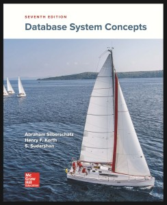

## Descrição

Esse repositório contém minha versão de soluções para o livro **[Sistema de Banco de Dados, 7a Edição](https://www.db-book.com/) (A. Silberschatz, H. Korth, S. Sudarshan)** (SBD).



## Apresentação

Espero que esse material chegue até estudantes e tutores de graduação e pós graduação que estejam cursando ou lecionando disciplinas relacionadas a Sistemas de Bancos de Dados.

Meu objetivo é que esse material sirva de complemento em português ao SBD. Naturalmente, muitos termos estão em inglês, sobretudo graças ao fato que os nomes de tabelas e colunas do material de laboratório estão em inglês - quem sabe um trabalho de tradução posterior para o autor ou para futuros apoiadores `;)`.

Muitas respostas estão diferentes da versão das soluções disponibilizadas em inglês. Em algumas vezes, trata-se de preferência. Em outras, acredito que há erros na versão original. Deixarei ao leitor decidir. Em todo caso, estejam alertados!

Em caso de dúvidas, correções, ou sugestões, por favor abra uma issue ou um PR nesse repositório.

Bons estudos!


## Instruções para o laboratório de exercícios

### Baixe as ferramentas:
  - Baixe e instale o *Docker* - https://docs.docker.com/get-started/get-docker/
  - Baixe e instale o *BeeKeeper* - https://www.pgadmin.org/

### Inicialize os bancos de dados

  - Execute:
      ```
      docker compose up
      ```

### Conecte-se a um banco de dados

  - Abra o *BeeKeeper* e conecte-se utilizando as informações a seguir:
    - host: `localhost`
    - user: `postgres`
    - pass: `1234`
  - Para o banco de dados menor, utilize:
    - port: `5431`
  - Para o banco de dados maior, utilize:
    - port: `5433`

## Autores

- Lucas Cavalcante <lucascpcavalcante@gmail.com>
